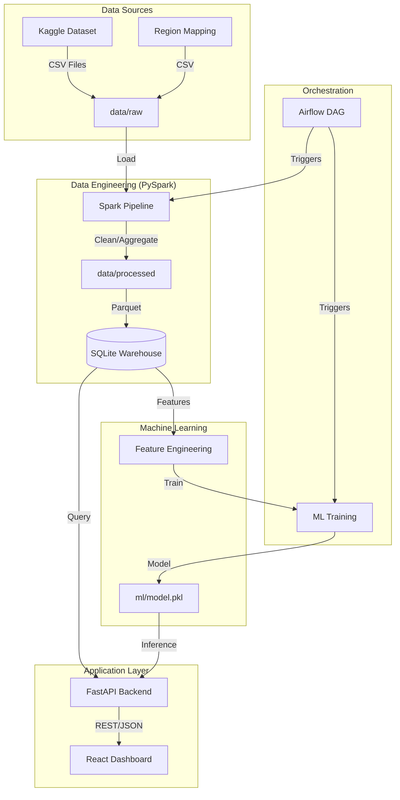

# Telecom Network Intelligence System - Architecture

This document describes the end-to-end architecture of the Telecom Network Intelligence System, designed to process millions of rows of network activity data and provide predictive insights.

## Architecture Diagram

## Component Details

### 1. Data Processing (PySpark)
- **Engine**: Apache Spark (via PySpark).
- **Process**: Ingests raw CSV activity logs, joins with spatial region mappings, and performs temporal aggregations.
- **Output**: Multi-million row datasets are stored as partitioned Parquet files for high-performance downstream usage.

### 2. Data Warehouse (SQLite)
- **Schema**: Star schema with a central `fact_usage` table and `dim_region`, `dim_time` dimension tables.
- **Purpose**: Provides a structured query interface for the API and a consistent feature source for ML.

### 3. Machine Learning Pipeline
- **Model**: Random Forest Classifier.
- **Objective**: Predict network congestion risk (HIGH/LOW) based on historical usage patterns.
- **Inference**: Real-time inference via the FastAPI layer using the serialized joblib model.

### 4. API & Visualization
- **Backend**: FastAPI with asynchronous endpoints for low-latency data retrieval.
- **Frontend**: React-based dashboard featuring real-time charts (D3.js/Chart.js) showing peak traffic hours and regional hotspots.
